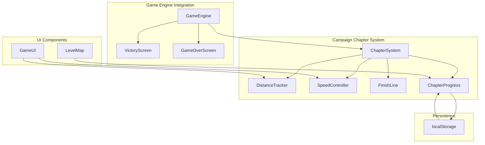

# Design Document: Campaign Chapter System

## Overview

Bu tasarım, Echo Shift oyununu sonsuz mesafe/skor sisteminden bölüm bazlı ilerleme sistemine dönüştürür. Her bölümün belirli bir hedef mesafesi vardır (bölüm numarası × 100 metre). Oyuncu bitiş çizgisine ulaştığında bölüm tamamlanır ve VictoryScreen gösterilir.

### Ana Değişiklikler
- Sonsuz oyun mantığı kaldırılıyor
- Her bölüm sabit hedef mesafeye sahip
- Tüm bölümler kilitli başlıyor (sadece 1. bölüm açık)
- Mesafeye bağlı logaritmik hız artışı
- Profesyonel bitiş çizgisi ve zafer animasyonları

## Architecture



## Components and Interfaces

### 1. ChapterConfig Interface

```typescript
interface ChapterConfig {
  id: number;                    // Bölüm numarası (1, 2, 3, ...)
  targetDistance: number;        // Hedef mesafe (id × 100 metre)
  baseSpeed: number;             // Başlangıç hızı (5 px/frame)
  isUnlocked: boolean;           // Bölüm açık mı?
  isCompleted: boolean;          // Bölüm tamamlandı mı?
}
```

### 2. ChapterProgressState Interface

```typescript
interface ChapterProgressState {
  completedChapters: number[];   // Tamamlanan bölüm ID'leri
  currentChapter: number;        // Şu an oynanan bölüm
  highestUnlocked: number;       // En yüksek açık bölüm
}
```

### 3. DistanceState Interface (Mevcut - Güncelleme)

```typescript
interface DistanceState {
  currentDistance: number;       // Şu anki mesafe (metre)
  targetDistance: number;        // Hedef mesafe (metre)
  progressPercent: number;       // İlerleme yüzdesi (0-100)
  isInClimaxZone: boolean;       // Son %20'de mi?
  isNearFinish: boolean;         // Son 50m'de mi?
}
```

### 4. SpeedState Interface

```typescript
interface SpeedState {
  baseSpeed: number;             // Temel hız (5 px/frame)
  currentSpeed: number;          // Şu anki hız
  climaxMultiplier: number;      // Climax çarpanı (1.0 veya 1.2)
  isInClimaxZone: boolean;       // Climax zone'da mı?
}
```

### 5. FinishLineState Interface

```typescript
interface FinishLineState {
  isVisible: boolean;            // Görünür mü?
  distanceToFinish: number;      // Bitiş çizgisine mesafe
  pulsePhase: number;            // Pulse animasyon fazı
  hasBeenCrossed: boolean;       // Geçildi mi?
}
```

## Data Models

### Chapter Data Generation

```typescript
// Bölüm verisi oluşturma
function generateChapterConfig(chapterId: number): ChapterConfig {
  return {
    id: chapterId,
    targetDistance: chapterId * 100,  // Requirement 1.1
    baseSpeed: 5,                      // Requirement 4.1
    isUnlocked: chapterId === 1,       // Requirement 2.1
    isCompleted: false,
  };
}

// Tüm bölümler (1-100)
const CHAPTERS: ChapterConfig[] = Array.from(
  { length: 100 },
  (_, i) => generateChapterConfig(i + 1)
);
```

### Speed Calculation Formula

```typescript
// Requirement 4.2: Logaritmik hız artışı
function calculateSpeed(
  baseSpeed: number,
  currentDistance: number,
  targetDistance: number
): number {
  // Logaritmik artış: baseSpeed × (1 + 0.3 × log(1 + distance/50))
  const logFactor = Math.log(1 + currentDistance / 50);
  let speed = baseSpeed * (1 + 0.3 * logFactor);
  
  // Requirement 4.4: Climax zone'da 1.2x çarpan
  const progressPercent = (currentDistance / targetDistance) * 100;
  if (progressPercent >= 80) {
    speed *= 1.2;
  }
  
  return speed;
}
```

### Persistence Schema

```typescript
// localStorage key
const CHAPTER_PROGRESS_KEY = 'echo_shift_chapter_progress';

// Stored data structure
interface StoredChapterProgress {
  completedChapters: number[];
  highestUnlocked: number;
  lastPlayedChapter: number;
}
```

## Correctness Properties

*A property is a characteristic or behavior that should hold true across all valid executions of a system-essentially, a formal statement about what the system should do. Properties serve as the bridge between human-readable specifications and machine-verifiable correctness guarantees.*

### Property 1: Target Distance Formula
*For any* chapter number N (where N >= 1), the target distance SHALL equal N × 100 meters.
**Validates: Requirements 1.1**

### Property 2: Level Completion Trigger
*For any* game state where currentDistance >= targetDistance, the system SHALL trigger level completion.
**Validates: Requirements 1.5**

### Property 3: Locked Chapter Access Prevention
*For any* chapter that is not in the completedChapters list and is not chapter 1, attempting to select it SHALL be prevented.
**Validates: Requirements 2.3**

### Property 4: Sequential Unlock Progression
*For any* completed chapter N, chapter N+1 SHALL become unlocked (added to accessible chapters).
**Validates: Requirements 2.4**

### Property 5: Chapter Progress Persistence Round-Trip
*For any* chapter progress state, saving to storage and then loading SHALL produce an equivalent state.
**Validates: Requirements 2.5, 8.1, 8.2**

### Property 6: Finish Line Visibility Threshold
*For any* distance state where (targetDistance - currentDistance) <= 50, the finish line SHALL be visible.
**Validates: Requirements 3.1**

### Property 7: Speed Formula Correctness
*For any* currentDistance value, the calculated speed SHALL equal baseSpeed × (1 + 0.3 × log(1 + currentDistance/50)).
**Validates: Requirements 4.2**

### Property 8: Climax Speed Multiplier
*For any* distance state where progressPercent >= 80, the speed SHALL include a 1.2x multiplier.
**Validates: Requirements 4.4**

### Property 9: Game Over State Preservation
*For any* game over event (health <= 0 before target), the completedChapters list SHALL remain unchanged.
**Validates: Requirements 6.1, 6.3**

### Property 10: Chapter Progress Reset on Completion
*For any* completed chapter, the in-progress distance and speed data SHALL be reset to initial values.
**Validates: Requirements 8.4**

## Error Handling

### Invalid Chapter Selection
- Locked chapter seçilmeye çalışılırsa: Hata mesajı göster, seçimi engelle
- Geçersiz chapter ID: Varsayılan olarak chapter 1'e yönlendir

### Storage Errors
- localStorage erişim hatası: Varsayılan state kullan, uyarı logla
- Bozuk veri: Varsayılan state'e sıfırla, kullanıcıyı bilgilendir

### Distance Calculation Errors
- Negatif mesafe: 0'a clamp et
- NaN/Infinity: Önceki geçerli değeri kullan

## Testing Strategy

### Property-Based Testing
- **Library**: fast-check (mevcut projede kullanılıyor)
- **Minimum iterations**: 100 per property
- **Tag format**: `**Feature: campaign-chapter-system, Property {number}: {property_text}**`

### Unit Tests
- Chapter config generation
- Speed calculation edge cases
- Persistence serialization/deserialization
- UI state transitions

### Integration Tests
- Full chapter completion flow
- Chapter unlock progression
- Game over handling
- Victory screen display

