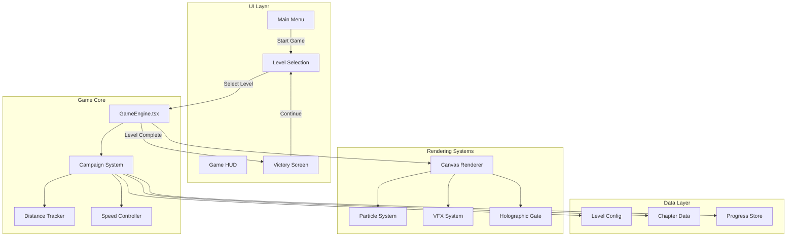

# Design Document

## Overview

Echo Shift v2.5 "Campaign Update" transforms the game's core loop from endless score-chasing to goal-oriented distance-based progression. This update makes the campaign the primary game mode, replacing the score metric with distance traveled, and introducing rich visual feedback systems that create an immersive, climactic gameplay experience.

### Key Changes
- **Distance-Based Gameplay**: Score replaced with distance (meters) as the primary metric
- **Campaign as Main Mode**: "Start Game" opens level selection directly
- **Progressive Speed System**: Speed increases throughout level with climax boost
- **Enhanced Visual Feedback**: Warp effects, chromatic aberration, holographic finish line
- **Improved Gem System**: Smaller, more numerous, horizontally spread gems
- **Victory Animations**: Flying currency, star reveals, path unlock effects

## Architecture



## Components and Interfaces

### 1. Distance Tracking System

```typescript
interface DistanceState {
  currentDistance: number;      // Current distance in meters
  targetDistance: number;       // Level's target distance
  progressPercent: number;      // 0-100 progress percentage
  isInClimaxZone: boolean;      // True when in final 20%
  isNearFinish: boolean;        // True when within 50m of target
}

interface DistanceTracker {
  update(deltaTime: number, speed: number): void;
  getState(): DistanceState;
  reset(targetDistance: number): void;
  isLevelComplete(): boolean;
}
```

### 2. Progressive Speed Controller

```typescript
interface SpeedConfig {
  baseSpeed: number;            // Level's base speed
  progressiveMultiplier: number; // Current progressive multiplier
  climaxMultiplier: number;     // Additional climax zone multiplier
  isInClimaxZone: boolean;
  climaxTransitionProgress: number; // 0-1 for smooth transition
}

interface SpeedController {
  calculateSpeed(distanceState: DistanceState, level: number): number;
  getConfig(): SpeedConfig;
  update(deltaTime: number): void;
}
```

### 3. Level Configuration (Updated)

```typescript
interface LevelConfig {
  id: number;
  chapter: ChapterType;
  targetDistance: number;       // Calculated: 350 + (level * 100) * (level ^ 0.1)
  baseSpeed: number;            // Calculated: 10 + (level * 0.4)
  obstacleDensity: number;      // Calculated: 0.5 + (level * 0.02), max 1.0
  mechanics: LevelMechanics;
  rewards: LevelRewards;
  starCriteria: StarCriteria;
}

type ChapterType = 'SUB_BASS' | 'BASS' | 'MID' | 'HIGH' | 'PRESENCE';

interface StarCriteria {
  survivor: boolean;            // Complete level (always true for 1 star)
  collectorThreshold: number;   // 80% of available shards for 2 stars
  perfectionist: boolean;       // No damage taken for 3 stars
}
```

### 4. Star Rating System

```typescript
interface LevelResult {
  completed: boolean;
  distanceTraveled: number;
  shardsCollected: number;
  totalShardsAvailable: number;
  damageTaken: number;
  healthRemaining: number;
}

interface StarRating {
  stars: number;                // 0-3
  survivor: boolean;            // 1 star criteria met
  collector: boolean;           // 2 star criteria met
  perfectionist: boolean;       // 3 star criteria met
}

function calculateStarRating(result: LevelResult): StarRating;
```

### 5. Gem Spawning System (Updated)

```typescript
interface GemSpawnConfig {
  size: number;                 // 60% of original size
  spawnRate: number;            // 2x original rate
  horizontalSpread: 'left' | 'center' | 'right' | 'random';
  safeMargin: number;           // Pixels from screen edge
}

interface GemPosition {
  x: number;                    // Horizontal position with spread
  y: number;                    // Vertical position (top/bottom lane)
}
```

### 6. Visual Effects System

```typescript
interface ClimaxVFX {
  starfieldStretch: number;     // 1.0 - 2.0 stretch factor
  chromaticAberration: number;  // 0 - 10 pixel RGB shift
  fovMultiplier: number;        // 1.0 - 1.15 FOV increase
  screenFlash: boolean;         // Trigger on finish
}

interface HolographicGate {
  visible: boolean;
  position: number;             // Distance position
  pulsePhase: number;           // 0-1 for BPM sync
  shatterProgress: number;      // 0-1 for shatter animation
}
```

### 7. Victory Screen System

```typescript
interface VictoryState {
  phase: 'slowmo' | 'stars' | 'rewards' | 'complete';
  slowmoProgress: number;       // 0-1 for 1 second slowmo
  starsRevealed: number;        // 0-3 stars shown
  flyingCurrencyActive: boolean;
  shardsAnimated: number;       // Counter for animated shards
}

interface FlyingCurrency {
  particles: CurrencyParticle[];
  targetPosition: { x: number; y: number };
  onParticleArrive: () => void;
}

interface CurrencyParticle {
  startPos: { x: number; y: number };
  currentPos: { x: number; y: number };
  controlPoint: { x: number; y: number }; // Bezier control
  progress: number;             // 0-1 animation progress
}
```

### 8. Level Map Animations

```typescript
interface PathUnlockAnimation {
  fromNode: number;             // Completed level ID
  toNode: number;               // Newly unlocked level ID
  lineProgress: number;         // 0-1 for line drawing
  unlockPopPhase: 'waiting' | 'scale' | 'flash' | 'settle';
}

interface ChapterTransition {
  fromChapter: ChapterType;
  toChapter: ChapterType;
  fadeProgress: number;         // 0-1 for cross-fade
}
```

## Data Models

### Campaign Progress Store

```typescript
interface CampaignProgress {
  currentLevel: number;
  lastPlayedLevel: number;
  completedLevels: number[];
  levelStars: Record<number, number>;
  levelStats: Record<number, LevelStats>;
  totalStars: number;
  chaptersUnlocked: ChapterType[];
}

interface LevelStats {
  bestDistance: number;
  bestShardsCollected: number;
  bestStars: number;
  timesPlayed: number;
  firstClearBonus: boolean;
}
```

### Level Session State

```typescript
interface LevelSession {
  levelId: number;
  startTime: number;
  currentDistance: number;
  targetDistance: number;
  shardsCollected: number;
  totalShardsSpawned: number;
  damageTaken: number;
  currentHealth: number;
  isComplete: boolean;
  isGameOver: boolean;
}
```


## Correctness Properties

*A property is a characteristic or behavior that should hold true across all valid executions of a system-essentially, a formal statement about what the system should do. Properties serve as the bridge between human-readable specifications and machine-verifiable correctness guarantees.*

Based on the prework analysis, the following properties have been identified for property-based testing:

### Distance and Level Completion Properties

**Property 1: Target distance formula correctness**
*For any* level number (1-100), the calculated target distance SHALL equal `350 + (level * 100) * (level ^ 0.1)` meters.
**Validates: Requirements 2.1**

**Property 2: Level completion trigger**
*For any* game state where currentDistance >= targetDistance, the level completion SHALL be triggered.
**Validates: Requirements 2.2**

**Property 3: Distance accumulation**
*For any* positive deltaTime and speed, the distance tracker SHALL increase currentDistance by `speed * deltaTime`.
**Validates: Requirements 2.3**

**Property 4: Game over on zero health**
*For any* game state where health = 0 and currentDistance < targetDistance, game over SHALL be triggered.
**Validates: Requirements 2.4**

### Speed System Properties

**Property 5: Progressive speed formula**
*For any* distance/target ratio, the calculated speed SHALL equal `baseSpeed * (1 + (currentDistance / targetDistance) * 0.3)`.
**Validates: Requirements 3.1**

**Property 6: Climax zone detection**
*For any* currentDistance >= 80% of targetDistance, isInClimaxZone SHALL be true.
**Validates: Requirements 3.2**

**Property 7: Climax speed multiplier**
*For any* game state in climax zone, the final speed SHALL include the 1.2x climax multiplier.
**Validates: Requirements 3.2**

**Property 8: Base speed formula**
*For any* level number, baseSpeed SHALL equal `10 + (level * 0.4)`.
**Validates: Requirements 3.4**

### Star Rating Properties

**Property 9: Survivor star (1 star)**
*For any* level completion with health > 0, at least 1 star SHALL be awarded.
**Validates: Requirements 4.1**

**Property 10: Collector star (2 stars)**
*For any* level completion where shardsCollected >= 80% of totalShardsAvailable, at least 2 stars SHALL be awarded.
**Validates: Requirements 4.2**

**Property 11: Perfectionist star (3 stars)**
*For any* level completion with damageTaken = 0, 3 stars SHALL be awarded.
**Validates: Requirements 4.3**

**Property 12: Star rating maximum selection**
*For any* combination of completion criteria, the star rating SHALL be the highest applicable value (1, 2, or 3).
**Validates: Requirements 4.4**

### Chapter and Level Organization Properties

**Property 13: Chapter assignment**
*For any* level ID, the chapter SHALL be correctly assigned: SUB_BASS (1-10), BASS (11-20), MID (21-30), HIGH (31-40), PRESENCE (41-50).
**Validates: Requirements 5.1**

**Property 14: Moving obstacles introduction**
*For any* level >= 21 (Chapter 3: MID), the mechanics.movingObstacles flag SHALL be true.
**Validates: Requirements 5.3**

**Property 15: Obstacle density formula**
*For any* level number, obstacle density SHALL equal `min(1.0, 0.5 + (level * 0.02))`.
**Validates: Requirements 5.4**

### Gem Spawning Properties

**Property 16: Gem spawn rate increase**
*For any* spawn interval, the campaign mode spawn rate SHALL be 2x the base rate.
**Validates: Requirements 7.2**

**Property 17: Gem horizontal spread**
*For any* spawned gem, its x-position SHALL be within the safe play bounds (left, center, or right zones).
**Validates: Requirements 7.3, 7.4**

### Reward Calculation Properties

**Property 18: First-clear bonus formula**
*For any* first-time level completion, the bonus SHALL equal `50 + (level * 10)` Echo Shards.
**Validates: Requirements 9.1**

**Property 19: Replay reward difference**
*For any* replay with higher star rating, the reward SHALL be the difference between new and previous reward amounts.
**Validates: Requirements 9.2**

**Property 20: Base reward formula**
*For any* level and star count, the base reward SHALL equal `10 + (level * 3) + (stars * 5)` Echo Shards.
**Validates: Requirements 9.3**

### Persistence Properties

**Property 21: Star rating persistence**
*For any* level completion, the star rating SHALL be persisted to storage and retrievable.
**Validates: Requirements 10.2**

**Property 22: Higher star rating update**
*For any* replay achieving higher stars, the stored rating SHALL be updated to the new value.
**Validates: Requirements 10.4**

**Property 23: Last played level persistence**
*For any* level played, the lastPlayedLevel SHALL be persisted and restored on game launch.
**Validates: Requirements 1.4**

### Visual Feedback Properties

**Property 24: Distance bar pulse trigger**
*For any* currentDistance within 50 meters of targetDistance, the distance bar pulse animation SHALL be active.
**Validates: Requirements 6.4**

**Property 25: Holographic gate visibility**
*For any* currentDistance within 100 meters of targetDistance, the holographic gate SHALL be visible.
**Validates: Requirements 12.1**

**Property 26: FOV increase in climax zone**
*For any* game state in climax zone, the FOV multiplier SHALL be > 1.0.
**Validates: Requirements 11.3**

**Property 27: Flying currency particle count**
*For any* flying currency animation, the particle count SHALL be between 10 and 20 inclusive.
**Validates: Requirements 8.4**

## Error Handling

### Invalid Level Selection
- If player selects a locked level, display lock indicator and prevent selection
- If level data is corrupted, fall back to level 1 configuration

### Distance Tracking Errors
- If deltaTime is negative or NaN, skip distance update
- If speed calculation produces NaN, use base speed as fallback

### Storage Failures
- If localStorage write fails, maintain in-memory state and retry on next opportunity
- If localStorage read fails, initialize with default progress (level 1, 0 stars)

### Animation Failures
- If particle system exceeds memory limits, reduce particle count
- If animation frame drops below 30fps, disable non-essential VFX (chromatic aberration, starfield stretch)

### Chapter Transition Errors
- If chapter theme assets fail to load, use previous chapter's theme
- If cross-fade animation fails, perform instant transition

## Testing Strategy

### Property-Based Testing Framework
- **Library**: fast-check (already used in project)
- **Minimum iterations**: 100 per property test
- **Test file location**: `systems/campaignUpdateV25.test.ts`

### Unit Tests
Unit tests will cover:
- Level configuration generation
- Star rating calculation edge cases
- Reward calculation edge cases
- Distance tracker state management
- Speed controller transitions

### Property-Based Tests
Each correctness property (1-27) will have a corresponding property-based test:
- Distance formula tests with arbitrary level numbers
- Speed calculation tests with arbitrary distance/target ratios
- Star rating tests with arbitrary completion states
- Reward calculation tests with arbitrary level/star combinations
- Persistence round-trip tests

### Integration Tests
- Full level completion flow (start → play → complete → victory screen)
- Level selection → game start → return to selection flow
- Chapter transition with theme changes
- First-clear bonus vs replay reward scenarios

### Visual Testing (Manual)
- Climax zone VFX activation
- Holographic gate appearance and shatter animation
- Flying currency animation smoothness
- Path unlock animation on level map
- Distance bar pulse animation

### Test Annotations
Each property-based test MUST include:
```typescript
// **Feature: campaign-update-v25, Property {N}: {property_text}**
// **Validates: Requirements X.Y**
```
