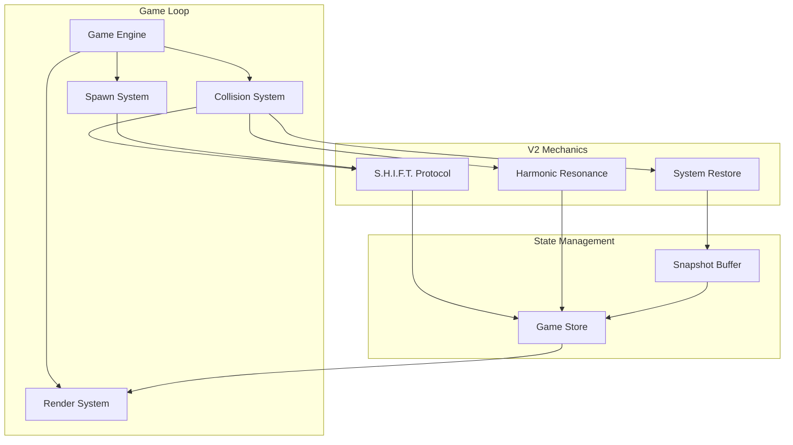
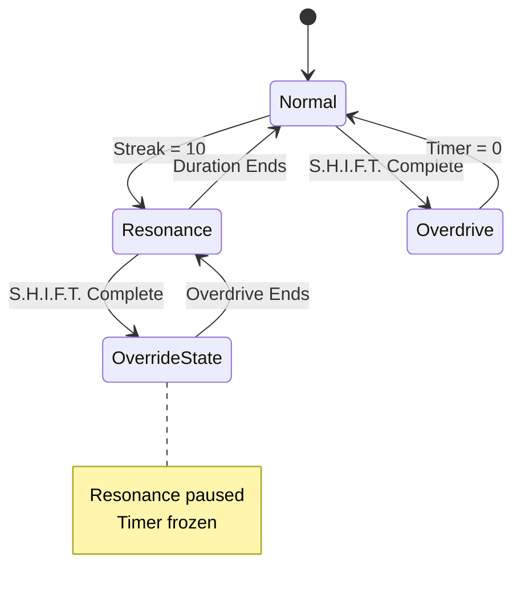

# Echo Shift v2.0 Mechanics - Design Document

## Overview

Echo Shift v2.0 introduces three interconnected engagement systems that create a compelling meta-loop beyond core gameplay:

1. **S.H.I.F.T. Protocol** - Letter collection system rewarding players with Overdrive mode
2. **Harmonic Resonance Enhancement** - Skill-based fever mode with dramatic visual feedback
3. **System Restore** - Economy-sink revive mechanic with VHS-style effects

These systems are designed to work together while respecting a clear **State Priority Hierarchy**:
- **Overdrive > Resonance** (Override pattern): When Overdrive activates during Resonance, Resonance pauses and resumes after Overdrive ends

## Architecture



### State Priority System

When multiple special states are active, the following priority applies:



## Components and Interfaces

### 1. S.H.I.F.T. Protocol System

**File:** `systems/shiftProtocol.ts`

```typescript
// Core Functions
function initializeShiftState(): ShiftProtocolState
function spawnCollectible(gameState: GameState): Collectible | null
function checkCollectibleCollision(orb: Point, collectible: Collectible): boolean
function collectLetter(state: ShiftProtocolState, letterIndex: number): ShiftProtocolState
function updateOverdrive(state: ShiftProtocolState, deltaTime: number): ShiftProtocolState
function calculateReachableY(connectorLength: number, midlineY: number): { min: number, max: number }
function calculateSpawnProbability(score: number): number
function selectNextLetter(collectedMask: boolean[]): number
```

### 2. Harmonic Resonance System

**File:** `systems/resonanceSystem.ts` (enhancement)

```typescript
// Core Functions
function initializeResonanceState(): ResonanceState
function updateStreak(state: ResonanceState, isRhythmHit: boolean): ResonanceState
function activateResonance(state: ResonanceState): ResonanceState
function deactivateResonance(state: ResonanceState): ResonanceState
function pauseResonance(state: ResonanceState): ResonanceState
function resumeResonance(state: ResonanceState): ResonanceState
function calculateScoreMultiplier(state: ResonanceState): number
function getColorScheme(state: ResonanceState, progress: number): ColorScheme
```

### 3. System Restore System

**File:** `systems/restoreSystem.ts` (enhancement)

```typescript
// Core Functions
function initializeSnapshotBuffer(capacity: number): SnapshotBuffer
function captureSnapshot(gameState: GameState): GameSnapshot
function pushSnapshot(buffer: SnapshotBuffer, snapshot: GameSnapshot): SnapshotBuffer
function getRestoreSnapshot(buffer: SnapshotBuffer): GameSnapshot | null
function executeRestore(gameState: GameState, snapshot: GameSnapshot): GameState
function clearSafeZone(obstacles: Obstacle[], playerX: number, radius: number): Obstacle[]
function canRestore(shards: number, hasUsedRestore: boolean): boolean
function calculateRestoreCost(): number
```

### 4. Collectible Renderer

**File:** `utils/collectibleRenderer.ts`

```typescript
function renderCollectible(ctx: CanvasRenderingContext2D, collectible: Collectible, time: number): void
function renderShiftHUD(ctx: CanvasRenderingContext2D, state: ShiftProtocolState): void
function renderOverdriveCore(ctx: CanvasRenderingContext2D, position: Point, rotation: number): void
function renderMagnetEffect(ctx: CanvasRenderingContext2D, center: Point, radius: number): void
```

## Data Models

### Collectible Interface

```typescript
export type CollectibleType = 'LETTER' | 'SHARD';

export interface Collectible {
  id: string;
  type: CollectibleType;
  value: string;           // 'S', 'H', 'I', 'F', 'T' or shard value
  x: number;
  y: number;
  baseY: number;           // Oscillation center point
  oscillationPhase: number;
  oscillationAmplitude: number;
  oscillationFrequency: number;
  isCollected: boolean;
}
```

### S.H.I.F.T. Protocol State

```typescript
export interface ShiftProtocolState {
  targetWord: string[];           // ['S', 'H', 'I', 'F', 'T']
  collectedMask: boolean[];       // [true, false, true, false, false]
  overdriveActive: boolean;
  overdriveTimer: number;         // milliseconds remaining
  coreRotation: number;           // Ying-Yang visual rotation
}
```

### Enhanced Resonance State

```typescript
export interface ResonanceState {
  isActive: boolean;
  isPaused: boolean;              // NEW: For Overdrive override
  pausedTimeRemaining: number;    // NEW: Frozen timer during pause
  streakCount: number;
  activationThreshold: number;    // 10
  duration: number;               // Total duration in ms
  remainingTime: number;          // Current remaining time
  multiplier: number;             // x2 when active
  intensity: number;              // 0.0 - 1.0 for effects
  colorTransitionProgress: number; // 0.0 - 1.0 for smooth transitions
}
```

### Snapshot System

```typescript
export interface GameSnapshot {
  timestamp: number;
  score: number;
  gameSpeed: number;
  playerPosition: number;
  orbSwapState: boolean;
  obstacles: Obstacle[];
  shiftState: ShiftProtocolState;
  resonanceState: ResonanceState;
  connectorLength: number;
  midlineY: number;
}

export interface SnapshotBuffer {
  snapshots: GameSnapshot[];
  head: number;                   // Circular buffer head index
  capacity: number;               // 180 (3 seconds at 60fps)
  size: number;                   // Current number of snapshots
}
```

### Game State Extension

```typescript
export enum GameStatus {
  MENU = 'MENU',
  PLAYING = 'PLAYING',
  PAUSED = 'PAUSED',
  GAME_OVER = 'GAME_OVER',
  RESTORING = 'RESTORING'         // NEW: VHS rewind state
}

// Add to existing GameState
export interface GameStateV2 extends GameState {
  status: GameStatus;
  shift: ShiftProtocolState;
  resonance: ResonanceState;
  snapshots: SnapshotBuffer;
  collectibles: Collectible[];
  hasUsedRestore: boolean;
  isInvulnerable: boolean;
  invulnerabilityTimer: number;
}
```

## Correctness Properties

*A property is a characteristic or behavior that should hold true across all valid executions of a system-essentially, a formal statement about what the system should do. Properties serve as the bridge between human-readable specifications and machine-verifiable correctness guarantees.*

### Property 1: Initial State Invariant
*For any* new game initialization, the S.H.I.F.T. state SHALL have `collectedMask` as `[false, false, false, false, false]`, `overdriveActive` as `false`, and `overdriveTimer` as `0`.
**Validates: Requirements 1.3, 1.4**

### Property 2: Reachability Constraint
*For any* spawned S.H.I.F.T. letter with oscillation parameters, the letter's Y position plus maximum oscillation amplitude SHALL never exceed `connectorLength - 20` pixels from the midline.
**Validates: Requirements 3.1, 3.2**

### Property 3: Oscillation Formula Correctness
*For any* collectible with baseY, amplitude, frequency, and time values, the calculated Y position SHALL equal `baseY + amplitude * sin(time * frequency)`.
**Validates: Requirements 3.3**

### Property 4: Spawn Probability Scaling
*For any* score value between 0 and 5000, the spawn probability SHALL be linearly interpolated between 5% and 15%.
**Validates: Requirements 3.4**

### Property 5: Letter Priority Selection
*For any* collectedMask state with at least one `false` value, the selected letter to spawn SHALL be from an uncollected index.
**Validates: Requirements 3.5**

### Property 6: Overdrive Activation Trigger
*For any* S.H.I.F.T. state where all 5 letters become collected, Overdrive mode SHALL activate immediately.
**Validates: Requirements 4.1**

### Property 7: Overdrive Invulnerability
*For any* collision event during active Overdrive, the player SHALL not die.
**Validates: Requirements 4.3**

### Property 8: Overdrive Obstacle Destruction
*For any* obstacle that contacts the player during active Overdrive, the obstacle SHALL be destroyed.
**Validates: Requirements 4.4**

### Property 9: Magnet Effect Range
*For any* Echo Shard within 150 pixels of the player during active Overdrive, the shard SHALL be pulled toward the player.
**Validates: Requirements 4.5**

### Property 10: Overdrive Timer Deactivation
*For any* Overdrive state where the timer reaches zero, Overdrive SHALL deactivate.
**Validates: Requirements 4.7**

### Property 11: Resonance Activation Threshold
*For any* rhythm streak reaching 10 consecutive passes, Harmonic Resonance SHALL activate.
**Validates: Requirements 5.1**

### Property 12: Streak Increment on Rhythm Hit
*For any* obstacle pass within the rhythm tolerance window, the streak counter SHALL increment by 1.
**Validates: Requirements 5.2**

### Property 13: Streak Reset on Miss
*For any* rhythm miss event, the streak counter SHALL reset to zero.
**Validates: Requirements 5.3**

### Property 14: Resonance Duration Preservation
*For any* active Resonance state, additional rhythm streaks SHALL not reset or extend the duration.
**Validates: Requirements 5.4**

### Property 15: Resonance Score Multiplier
*For any* score earned during active Harmonic Resonance, the score SHALL be multiplied by 2.
**Validates: Requirements 6.2**

### Property 16: Snapshot Buffer Capacity
*For any* snapshot buffer operation, the buffer size SHALL never exceed 180 snapshots.
**Validates: Requirements 7.1, 7.3**

### Property 17: Snapshot Completeness
*For any* captured snapshot, it SHALL contain: timestamp, score, player position, orb swap state, obstacle positions, current speed, and difficulty parameters.
**Validates: Requirements 7.2**

### Property 18: Buffer Cleanup on Game End
*For any* normal game run end, the snapshot buffer SHALL be cleared.
**Validates: Requirements 7.4**

### Property 19: Restore Button State
*For any* player balance less than 100 Echo Shards, the restore button SHALL be disabled.
**Validates: Requirements 8.3**

### Property 20: Restore Currency Deduction
*For any* restore activation, exactly 100 Echo Shards SHALL be deducted from the player's balance.
**Validates: Requirements 8.4**

### Property 21: Restore State Rewind
*For any* restore execution, the game state SHALL match the snapshot from 3 seconds before collision.
**Validates: Requirements 8.5**

### Property 22: Safe Zone Clearance
*For any* restore execution, no obstacles SHALL exist within 100 pixels of the player position.
**Validates: Requirements 8.6**

### Property 23: Post-Restore Invulnerability
*For any* completed restore, the player SHALL have 2 seconds of invulnerability.
**Validates: Requirements 8.7**

### Property 24: Single Restore Per Run
*For any* game run where restore has been used, further restore offers SHALL be disabled.
**Validates: Requirements 8.8**

### Property 25: Letter Collision Detection
*For any* orb position within 20 pixels of a letter's center, the letter SHALL be marked as collected.
**Validates: Requirements 9.1, 9.2**

### Property 26: Letter Removal on Collection
*For any* collected letter, it SHALL be removed from the active collectibles list.
**Validates: Requirements 9.3**

### Property 27: Letter Collection Reward
*For any* letter collection event, exactly 50 Echo Shards SHALL be awarded.
**Validates: Requirements 9.4**

## Error Handling

### Collision Edge Cases
- **Simultaneous Collection**: If both orbs touch the same letter in the same frame, only one collection event fires
- **Overdrive + Resonance Overlap**: Overdrive takes priority; Resonance pauses and resumes after Overdrive ends
- **Buffer Overflow**: Circular buffer automatically discards oldest snapshots

### State Recovery
- **Invalid Snapshot**: If snapshot data is corrupted, restore fails gracefully and refunds shards
- **Missing Collectible**: If a collectible reference is invalid, skip without crashing
- **Timer Underflow**: Clamp all timers to minimum of 0

### Performance Safeguards
- **Max Collectibles**: Limit active collectibles to 10 to prevent memory issues
- **Snapshot Frequency**: Capture at 60fps but can reduce to 30fps on low-end devices
- **Particle Limits**: Cap particles at 200 during Overdrive effects

## Testing Strategy

### Property-Based Testing Library
**Library:** fast-check (TypeScript)

All property-based tests will use fast-check with a minimum of 100 iterations per property.

### Unit Tests
- Initial state creation functions
- Individual calculation functions (oscillation, probability, collision)
- State transition functions
- Buffer operations

### Property-Based Tests
Each correctness property will have a corresponding property-based test:

1. **Initial State Tests**: Generate random game configurations, verify initial state invariants
2. **Reachability Tests**: Generate random connector lengths and spawn positions, verify constraints
3. **Collision Tests**: Generate random orb and letter positions, verify collision detection accuracy
4. **State Transition Tests**: Generate sequences of events, verify state machine correctness
5. **Buffer Tests**: Generate random snapshot sequences, verify capacity constraints

### Integration Tests
- Full S.H.I.F.T. collection flow → Overdrive activation
- Resonance + Overdrive overlap handling
- Restore flow from death → rewind → gameplay resume
- Currency flow through collection and restore

### Test Annotation Format
All property-based tests will be annotated with:
```typescript
// **Feature: echo-shift-v2-mechanics, Property {number}: {property_text}**
```
