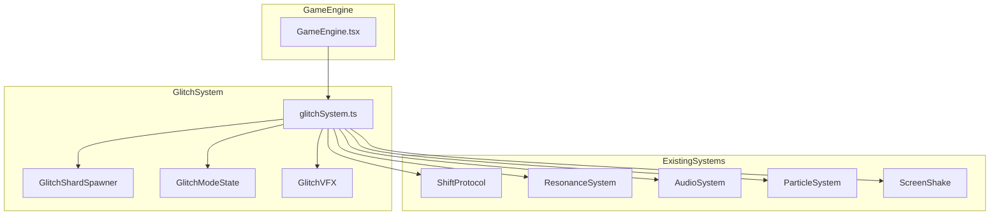

# Glitch Protocol - Design Document

## Overview

Glitch Protocol, Echo Shift oyununa eklenen özel bir bonus modu sistemidir. Oyuncu, nadir görülen "Glitch Shard" objesine dokunduğunda "Quantum Lock" moduna girer. Bu mod, 8 saniye boyunca oyuncuya güvenli bir elmas toplama deneyimi sunar.

### Temel Akış
```
Normal Oyun → Glitch Shard Spawn → Oyuncu Toplar → Hit Stop + VFX → 
Quantum Lock Aktif (8sn) → Exit Warning (%75) → Wave Flatten (%80) → 
Ghost Mode (1.5sn) → Normal Oyun
```

## Architecture



## Components and Interfaces

### 1. GlitchShard Interface
```typescript
interface GlitchShard {
  id: string;
  x: number;
  y: number;
  width: number;
  height: number;
  active: boolean;
  colorTimer: number;
  spawnTime: number;
}
```

### 2. GlitchModeState Interface
```typescript
interface GlitchModeState {
  isActive: boolean;
  startTime: number;
  duration: number;
  originalConnectorLength: number;
  waveOffset: number;
  phase: 'inactive' | 'active' | 'warning' | 'exiting' | 'ghost';
  ghostModeEndTime: number;
  // Paused mode tracking
  pausedOverdriveTime: number;
  pausedResonanceTime: number;
}
```

### 3. GlitchConfig Interface
```typescript
interface GlitchConfig {
  duration: number;              // 8000ms
  idealConnectorLength: number;  // 120px
  waveSpeed: number;             // 0.05
  waveAmplitude: number;         // 120px
  ghostModeDuration: number;     // 1500ms
  warningThreshold: number;      // 0.75 (75%)
  flattenThreshold: number;      // 0.80 (80%)
  shardMultiplier: number;       // 2x
  minSpawnDistance: number;      // 500m
  spawnClearance: number;        // 150px
  colors: string[];              // ['#00FFFF', '#FF00FF', '#FFFFFF', '#00FF00']
}
```

### 4. Core Functions

```typescript
// Spawn Management
function createGlitchShard(canvasWidth: number, canvasHeight: number): GlitchShard;
function shouldSpawnGlitchShard(distanceTraveled: number, hasSpawnedThisLevel: boolean): boolean;
function isSpawnPositionSafe(y: number, obstacles: Obstacle[]): boolean;

// State Management
function createInitialGlitchModeState(): GlitchModeState;
function activateQuantumLock(state: GlitchModeState, currentConnectorLength: number): GlitchModeState;
function updateGlitchMode(state: GlitchModeState, deltaTime: number): GlitchModeState;
function getPhaseFromProgress(progress: number): GlitchModeState['phase'];

// Collision Detection
function checkGlitchShardCollision(
  playerX: number, 
  playerY: number, 
  connectorLength: number, 
  shard: GlitchShard
): boolean;

// Wave Calculation
function calculateWaveY(x: number, offset: number, amplitude: number, centerY: number): number;
function getWaveAmplitudeForPhase(phase: GlitchModeState['phase'], progress: number): number;

// Connector Animation (with elastic easing)
function calculateConnectorLength(
  state: GlitchModeState, 
  currentLength: number, 
  targetLength: number, 
  deltaTime: number
): number;
function elasticOut(t: number): number; // Elastic easing for "bounce" feel
function finalizeConnectorLength(state: GlitchModeState, originalLength: number): number; // Hard-set on completion

// Input Buffering (for hit stop)
function bufferInput(input: InputState): void;
function flushBufferedInput(): InputState | null;

// Bonus Shard Path Generation
function generateWavePathShards(waveOffset: number, canvasWidth: number, centerY: number, amplitude: number): ShardPosition[];

// Rendering
function renderGlitchShard(ctx: CanvasRenderingContext2D, shard: GlitchShard): void;
function renderSinusTunnel(ctx: CanvasRenderingContext2D, width: number, height: number, offset: number, amplitude: number): void;
function renderStaticNoise(ctx: CanvasRenderingContext2D, width: number, height: number, intensity: number): void;
```

### 5. Input Buffering System

Hit Stop sırasında oyuncu girdileri tamponlanır ve donma bittiğinde işlenir:

```typescript
interface InputBuffer {
  pendingSwap: boolean;
  pendingTap: boolean;
  timestamp: number;
}

// Hit stop sırasında girdi gelirse tampona al
// Hit stop bittiğinde tamponu işle ve temizle
```

### 6. Elastic Easing Formula

Çubuk geçişleri için elastic-out easing:

```typescript
function elasticOut(t: number): number {
  const c4 = (2 * Math.PI) / 3;
  return t === 0 ? 0 : t === 1 ? 1 : 
    Math.pow(2, -10 * t) * Math.sin((t * 10 - 0.75) * c4) + 1;
}
```

### 7. Wave Path Shard Distribution

Bonus elmaslar dalga formunu takip eden bir yol şeklinde dizilir (10-15 elmas):

```typescript
interface ShardPosition {
  x: number;
  y: number;
  collected: boolean;
}

// Elmaslar sinüs dalgasının tam üzerine, eşit aralıklarla dizilir
// Oyuncu dalga üzerinde "sörf" yaparak toplar
```

## Data Models

### State Transitions
```
INACTIVE → ACTIVE (on collision)
ACTIVE → WARNING (at 75% duration)
WARNING → EXITING (at 80% duration)
EXITING → GHOST (at 100% duration)
GHOST → INACTIVE (after 1500ms)
```

### Priority System
```
Quantum Lock (Highest)
    ↓ pauses
Overdrive
    ↓ pauses
Resonance (Lowest)
```

## Correctness Properties

*A property is a characteristic or behavior that should hold true across all valid executions of a system-essentially, a formal statement about what the system should do. Properties serve as the bridge between human-readable specifications and machine-verifiable correctness guarantees.*

### Property 1: Spawn Position Bounds
*For any* canvas dimensions and spawn call, the spawned Glitch Shard's X position SHALL equal canvasWidth + 100, and Y position SHALL be within centerY ± 100 pixels.
**Validates: Requirements 2.2, 2.3**

### Property 2: Spawn Distance Threshold
*For any* distance value less than 500 meters, shouldSpawnGlitchShard SHALL return false.
**Validates: Requirements 2.7**

### Property 3: Spawn Safety Clearance
*For any* spawn position and obstacle set, if any obstacle is within 150px of the spawn Y position, isSpawnPositionSafe SHALL return false.
**Validates: Requirements 2.6**

### Property 4: Shard Movement
*For any* Glitch Shard with initial X position and game speed, after one frame update, the shard's X position SHALL decrease by exactly the speed value.
**Validates: Requirements 2.4**

### Property 5: Shard Removal
*For any* Glitch Shard with X position less than negative shard width, the shard SHALL be removed from active objects.
**Validates: Requirements 2.5**

### Property 6: AABB Collision Detection
*For any* player position (x, y, connectorLength) and Glitch Shard bounds, checkGlitchShardCollision SHALL return true if and only if the player's vertical range intersects the shard's bounds AND the player's X range intersects the shard's X range.
**Validates: Requirements 3.1**

### Property 7: Collision Triggers Mode Activation
*For any* collision detection that returns true, the resulting GlitchModeState SHALL have isActive=true, phase='active', and originalConnectorLength set to the pre-collision connector length.
**Validates: Requirements 3.5, 3.6, 4.1**

### Property 8: Connector Length Round-Trip
*For any* initial connector length, after Quantum Lock activation and completion, the connector length SHALL be hard-set to exactly the original stored value (no floating point drift).
**Validates: Requirements 4.1, 4.4**

### Property 9: Connector Lock During Mode
*For any* GlitchModeState with isActive=true, external connector length changes SHALL be ignored, and the connector SHALL animate toward idealConnectorLength.
**Validates: Requirements 4.2, 4.3**

### Property 10: Wave Offset Progression
*For any* active Quantum Lock state and positive deltaTime, the waveOffset SHALL increase by waveSpeed * deltaTime.
**Validates: Requirements 5.2**

### Property 11: Speed Stabilization
*For any* active Quantum Lock state, the game speed SHALL remain constant (no acceleration).
**Validates: Requirements 5.7**

### Property 12: Obstacle Spawn Prevention
*For any* active Quantum Lock state, new obstacle spawn calls SHALL be blocked.
**Validates: Requirements 6.1**

### Property 13: Invulnerability During Bonus Modes
*For any* active Quantum Lock OR Ghost Mode state, collision damage SHALL be prevented (return 0 damage).
**Validates: Requirements 6.3, 7.6**

### Property 14: Shard Value Multiplier
*For any* shard collected during active Quantum Lock, the value SHALL be multiplied by 2.
**Validates: Requirements 6.5**

### Property 15: Distance Accumulation
*For any* active Quantum Lock state and positive deltaTime, distance traveled SHALL continue to accumulate.
**Validates: Requirements 6.6**

### Property 16: Duration Initialization
*For any* newly activated Quantum Lock, the duration SHALL be set to 8000ms.
**Validates: Requirements 7.1**

### Property 17: Phase Transitions
*For any* Quantum Lock progress value, getPhaseFromProgress SHALL return:
- 'active' for progress < 0.75
- 'warning' for 0.75 <= progress < 0.80
- 'exiting' for 0.80 <= progress < 1.0
- 'ghost' for progress >= 1.0
**Validates: Requirements 7.2, 7.3, 7.4**

### Property 18: Ghost Mode Duration
*For any* Quantum Lock that completes, Ghost Mode SHALL last exactly 1500ms.
**Validates: Requirements 7.4**

### Property 19: State Restoration
*For any* Ghost Mode that completes, all gameplay states SHALL return to normal (isActive=false, phase='inactive').
**Validates: Requirements 7.7**

### Property 20: Overdrive Pause/Resume Round-Trip
*For any* active Overdrive mode when Quantum Lock activates, the Overdrive timer SHALL be paused, and when Quantum Lock ends, Overdrive SHALL resume with the exact remaining time.
**Validates: Requirements 6.7, 7.8, 10.1, 10.3**

### Property 21: Resonance Pause/Resume Round-Trip
*For any* active Resonance mode when Quantum Lock activates, the Resonance timer SHALL be paused, and when Quantum Lock ends, Resonance SHALL resume with the exact remaining time.
**Validates: Requirements 10.2, 10.3**

### Property 22: Priority Override
*For any* state where Quantum Lock is active, Overdrive and Resonance effects SHALL be suspended.
**Validates: Requirements 10.4**

## Error Handling

| Error Case | Handling |
|------------|----------|
| Spawn position blocked | Retry spawn with offset Y position |
| Multiple shards spawned | Only first shard is active, others ignored |
| Mode activation during existing mode | Queue activation for after current mode ends |
| Invalid connector length | Clamp to min/max bounds |
| Audio system unavailable | Continue without audio, log warning |
| Input during hit stop | Buffer input, process after hit stop ends |
| Float precision drift | Hard-set connector length on mode completion |

## Testing Strategy

### Unit Testing
- Test spawn position calculations
- Test collision detection edge cases
- Test phase transition logic
- Test connector animation math

### Property-Based Testing
Using `fast-check` library for property-based tests:

1. **Spawn Properties**: Generate random canvas sizes and verify spawn bounds
2. **Collision Properties**: Generate random player/shard positions and verify AABB logic
3. **State Transition Properties**: Generate random progress values and verify phase transitions
4. **Round-Trip Properties**: Verify connector length and paused mode restoration

Each property-based test SHALL:
- Run minimum 100 iterations
- Be tagged with format: `**Feature: glitch-protocol, Property {number}: {property_text}**`
- Reference the correctness property from this design document

### Integration Testing
- Test full activation → completion flow
- Test interaction with Overdrive system
- Test interaction with Resonance system
- Test GameEngine integration
