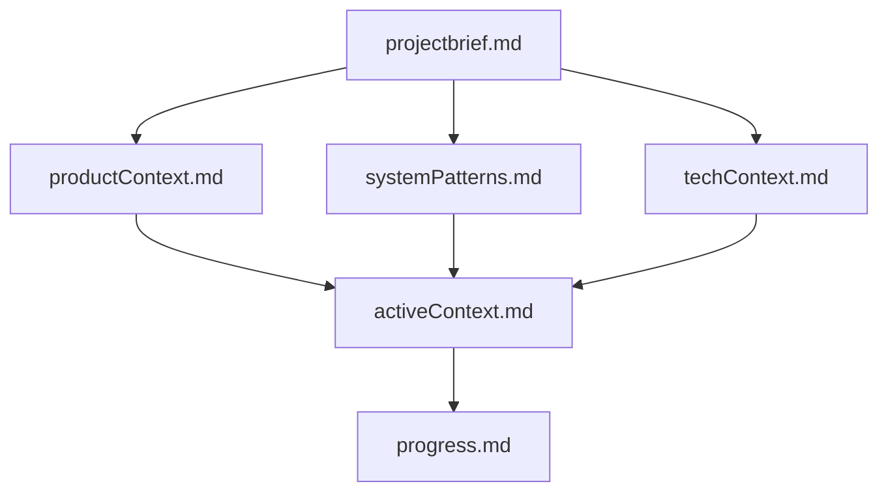

# AGENTS.md

Bu repo, **Cline Memory Bank** metodolojisini kullanır: AI/agent her yeni görevde önce Memory Bank dosyalarını okuyarak proje bağlamını yeniden kurar ve kalıcı dokümantasyonu güncel tutar.

Kaynak dokümantasyon: [Cline Memory Bank](https://docs.cline.bot/prompting/cline-memory-bank)

## Zorunlu Kural (Her Task Başında)

- `memory-bank/` altındaki **tüm çekirdek dosyaları** oku:
  - `projectbrief.md`
  - `productContext.md`
  - `systemPatterns.md`
  - `techContext.md`
  - `activeContext.md`
  - `progress.md`

Bu adım **opsiyonel değildir**. Bu dosyalar repo’nun “kalıcı hafızasıdır”.

## Memory Bank Yapısı

## Çalışma Akışları

### Plan / Tasarım Modu

- Önce Memory Bank’i oku.
- Eksik/yanlış bağlam varsa `activeContext.md` içine “açık sorular / varsayımlar” ekle.
- Yaklaşımı netleştir ve uygulamaya geç.

### Act / Uygulama Modu

- Kod değişikliklerini yap.
- Anlamlı bir milestone sonrası veya yön değişiminde Memory Bank’i güncelle:
  - `activeContext.md`: şu an ne üzerinde çalışılıyor + bir sonraki adımlar
  - `progress.md`: tamamlananlar / kalanlar / bilinen sorunlar
  - Gerekirse `systemPatterns.md` ve `techContext.md`

## “update memory bank” Kuralı

Eğer kullanıcı “**update memory bank**” derse:

- Yukarıdaki **6 çekirdek dosyanın tamamını** gözden geçir.
- Gerekli güncellemeleri yap.
- Özellikle `activeContext.md` ve `progress.md` odak dosyalarıdır.

## Repo-Spesifik Notlar

- Bu repo bir **Vite + React + TypeScript** tabanlı arcade oyunudur (“Echo Shift”).
- Oyun döngüsü ağırlıkla `components/GameEngine.tsx` içinde, UI/state orchestration `App.tsx`’te.
- Kalıcı durum: `store/gameStore.ts` (Zustand) + `utils/persistence.ts` (localStorage güvenli adapter).
